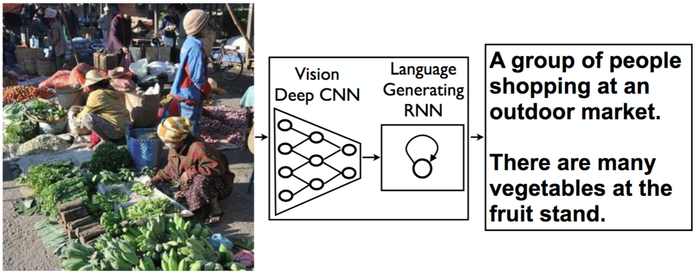

# Image Captioning Project

## Overview

This project aims to develop a neural network architecture for automatically generating captions from images, inspired by the paper [Show and Tell: A Neural Image Caption Generator](https://arxiv.org/pdf/1411.4555.pdf). The system combines Convolutional Neural Networks (CNNs) for image processing and Recurrent Neural Networks (RNNs) for text generation. The CNN encodes the image into a fixed-length vector, which is then decoded by the RNN into a descriptive sentence. The model is trained using the Microsoft Common Objects in Context ([MS COCO](http://cocodataset.org/#home)) dataset. This README provides detailed instructions for setting up and running the project, showcasing the integration of advanced computer vision and natural language processing techniques.

## Table of Contents
- [Prerequisites](#prerequisites)
- [Project Structure](#project-structure)
- [Usage](#usage)
  - [Training](#training)
  - [Inference](#inference)
- [Results](#results)
- [Troubleshooting](#troubleshooting)
- [Acknowledgments](#acknowledgments)

## Prerequisites

Before running the project, ensure you have the following prerequisites installed:

- Python (>=3.6)
- PyTorch (>=0.4)
- NumPy
- Matplotlib
- Jupyter Notebook (for running the provided notebooks)
- scikit-image
- nltk

You can install most of these dependencies using pip or conda.

**Important**: GPU mode must be enabled for this project. Training the model on a GPU is expected to take between 5-12 hours. It is recommended to monitor early patterns in loss during the first hour of training to make adjustments to your model, minimizing extensive training until you are ready for final training.

## Project Structure

The project directory is organized as follows:

- **0_Dataset.ipynb**: Explores the Microsoft COCO dataset used for training the image captioning model. This notebook demonstrates how to initialize the COCO API, print a sample image, and display its five corresponding captions. For more details, visit the [MS COCO](http://cocodataset.org/#home) website or the [research paper](https://arxiv.org/pdf/1405.0312).

- **1_Preliminaries.ipynb**: Handles loading and preprocessing data from the COCO dataset. This notebook also involves designing the CNN-RNN architecture for generating image captions.

- **2_Training.ipynb**: Trains the CNN-RNN model developed in the previous notebook. Adjust model parameters as needed and monitor loss patterns during training.

- **3_Inference.ipynb**: Uses the trained model to generate captions for images in the test dataset. Evaluates model performance by comparing generated captions with actual captions.

## Usage

### Training

To train the network:

1. **0_Dataset.ipynb**:
   - Load and explore the MS COCO dataset.
   - Initialize the COCO API and print a sample image with its corresponding captions.

2. **1_Preliminaries.ipynb**:
   - Preprocess the data from the COCO dataset.
   - Design and develop the CNN-RNN model.

3. **2_Training.ipynb**:
   - Train the CNN-RNN model using the preprocessed data.
   - Adjust model parameters as needed and monitor loss patterns.

#### Suggestions for Modifying the Model

- Experiment with different architectures for the CNN and RNN components.
- Vary the size of hidden layers or the number of layers in the RNN.
- Adjust hyperparameters such as learning rate, batch size, and number of epochs to observe their impact on model performance.

### Inference

To see the model in action:

1. **3_Inference.ipynb**:
   - Use the trained model to generate captions for images in the test dataset.
   - Evaluate model performance by comparing generated captions with actual captions.

#### Steps for Inference

- Load the trained model.
- Pass a test image through the model to generate a caption.
- Compare the generated caption with the actual caption to evaluate performance.

## Results (Under Revision)

- Provide results for specific examples.
- Document results when changing different hyperparameters.
- Refer to similar projects on GitHub for additional insights.

## Troubleshooting

For typical troubleshooting, please check the Wiki page of the project. A list of troubleshooting tips will be updated on the Wiki page. If you encounter issues, please email me at [hhosseinianfar@gmail.com](mailto:hhosseinianfar@gmail.com) or submit an issue so I can address it.

## Acknowledgments

- This project is part of the [Computer Vision Nanodegree](https://www.udacity.com/course/computer-vision-nanodegree--nd891) program from Udacity.
- The project's architecture and data loader are based on research papers and materials provided by Udacity.

Feel free to explore, experiment, and enhance this project according to your needs. Enjoy working on image captioning!
